# Gymshark

## Project Decisions
### Structure
- I have chosen to use `MVVM` as it separates UI, data presentation, and business logic by utilizing a ViewModel to mediate the communication between the View and Model.
- I have broken the project into sections of the app such as Search, PhotoDetails and UserProfile, each consisting of ViewModels & Views corresponding to the page.
- I have an `Infrastructure` folder which contains files such as AppDelegate, BaseClasses, Navigation, Notifications, Utils, Extensions etc.
- I have moved the `services` into their own target to keep it away from the main application and not clutter the main project.
- I have chosen to use `SwiftUI` as it allows for faster development, though it has its downsides.
- I have implemented `DependencyInjection` for better maintainability and testability of the application.
    
### Services
- I have chosen to use `Combine` for 2 reasons:
    1: Combine it has already been out for a while and a lot of projects are already using it.
    2: The job required it and I wanted to showcase that I know how to use it (By no means am I an expert)
- I would've probably used `async/await` for this as it would have been far simpler and for what I had to do it would've been more than acceptable.
- Overall I would use Combine when dealing with more complex data streams and handling multiple publishers that need to be composed.

### What I would have done with more time:
- Better error handling
    - Errors and Crashes are something that should be caught either by using something like Firebase Analytics or Sentry
    - Currently other than displaying an image nothing is different, they can tap on a button to refresh but an alert would be more appropriate as it could tell them what the problem is.
- Tests
    - In an actual app I would've used a framework such as Mockingbird to create mocks of each service rather than make them myself.
    - I would've tested more functionality in the ViewModels such as pagination, and search query.
    - Isolating the views from triggering `onAppear` functionality when running `UnitTests` (using EnvironmentVariables)
    - Writing Snapshot Tests:
        - I would've created some snapshot tests as a simple and quick way of checking that everything looks good.
        - I decided not to as they can be a bit temperamental from my experience and I have personally removed it from the build & test pipeline, It has its own test pipeline which I check whenever it fails as just a simple iOS or XCode version could break it.
    - Writing UITests would be a must in order to verify the flow of the app is still functioning and that nothing has been missed or broken during development and it would help a lot with regression tests.
- I would've followed the design system better and created some colour pallets rather than using Color.white, Color.black etc. and apply opacity to them

### With more time
- Products Search
    - I would've added a search bar to be able to filter between items by text
    - I would've added more filters (Type [Leggings, Bra etc.], Price Range)
- Products Details
    - Probably add some suggestion items in the same category at the bottom of the page similar to the website.
    - I would've made a functional wishlist and basket
- Development
    - I would've added an wishlist and basket view.
    - I would've added more tests `Snapshot`, `UITests` to cover the Services to a certain extent.
    - I would've added a local database to store some details about the user and only refresh them after they expire or the user asks for them.
    - I would've implemented better navigation  by following the `MVVM-C` pattern.
    - In an actual application I would think about `accessibility` and how to better help people navigate the app. 
 
## Requirements
### Pages
 - Search List:
    - Display items and provide details (Item, Title, Price, Colour etc)
    - Handle Incorrect/Missing images
    - Product contain `Labels` which indicate different states `Enum`
    
- Property Details:
    - Display all the information returned by the items.
    - Description contains HTML text needs to be handled appropriately. 
    
### API/Responses
- Products List: https://cdn.develop.gymshark.com/training/mock-product-responses/algolia-example-payload.json

## Screenshots

| 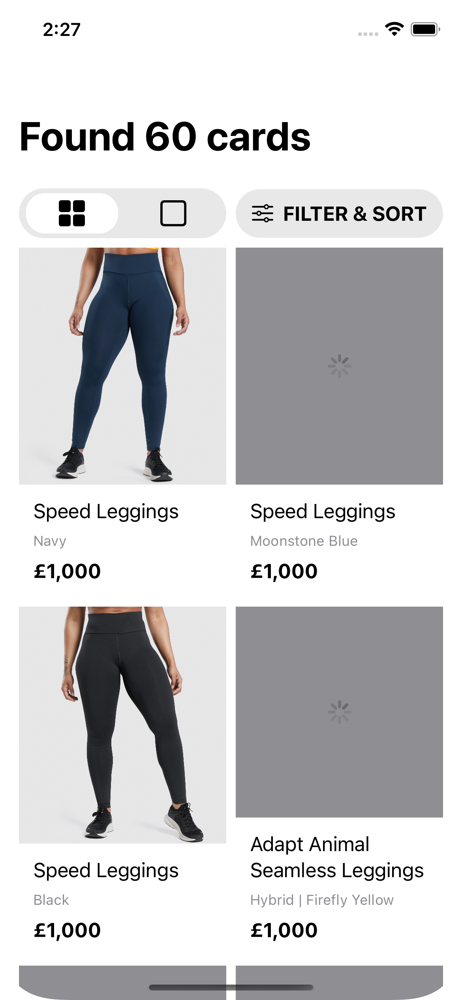  | 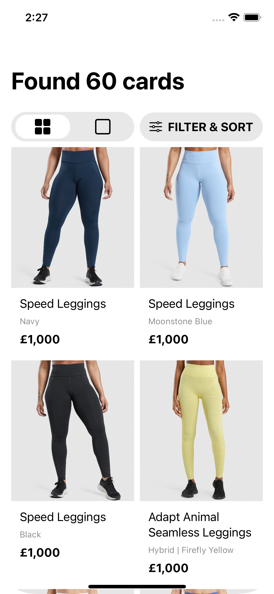  | 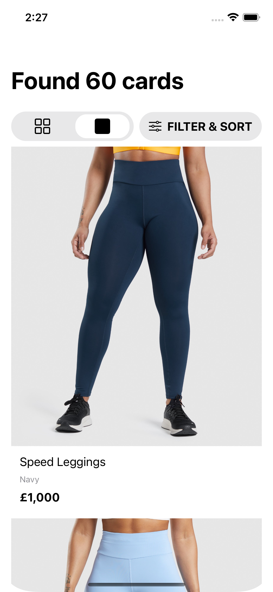  |
| ------------------------ | ------------------------ | ------------------------ |
| 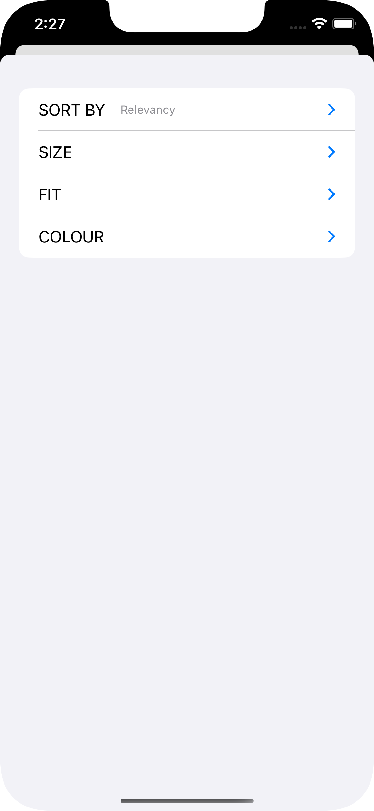  | 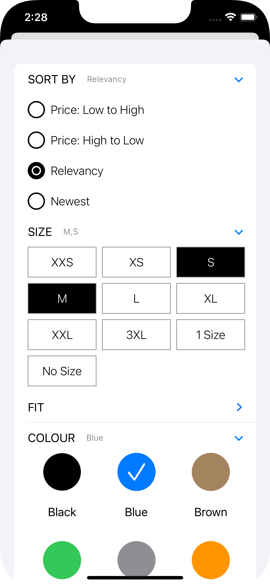  | 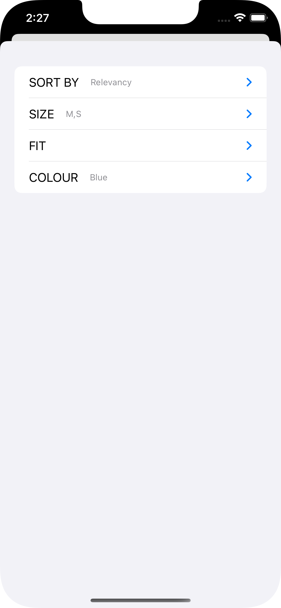  |
| 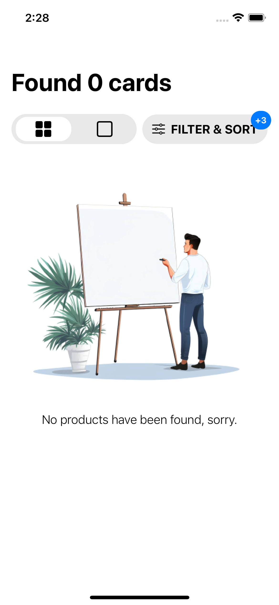  | 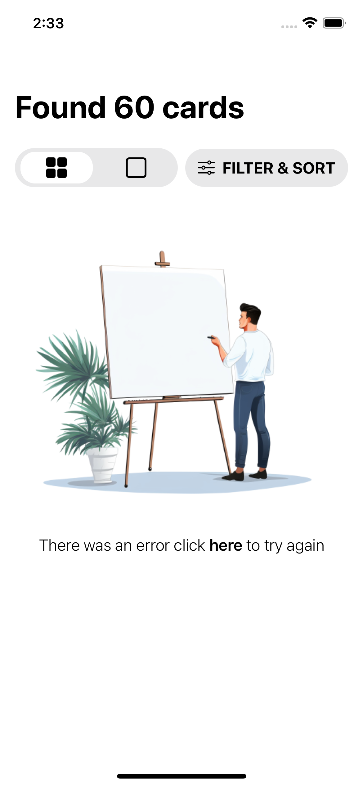  | 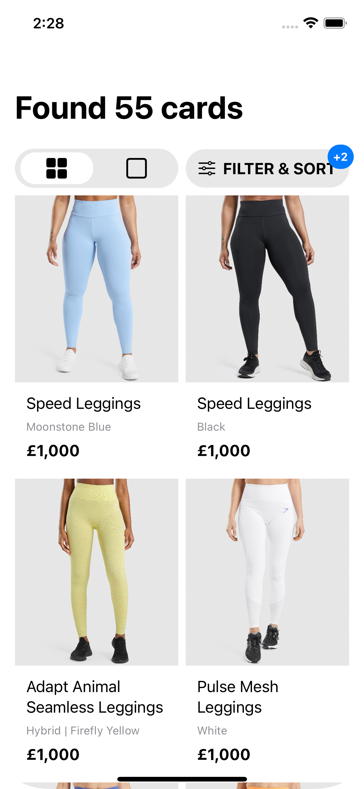  |
| 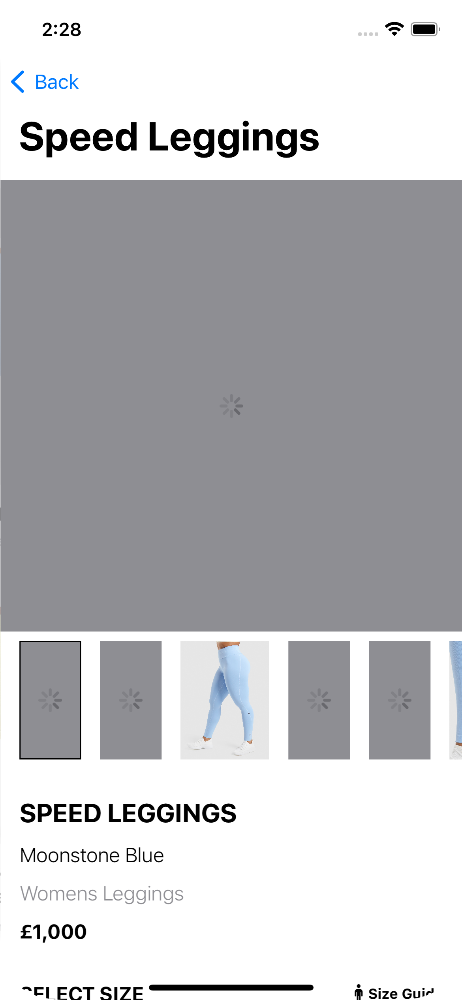 | 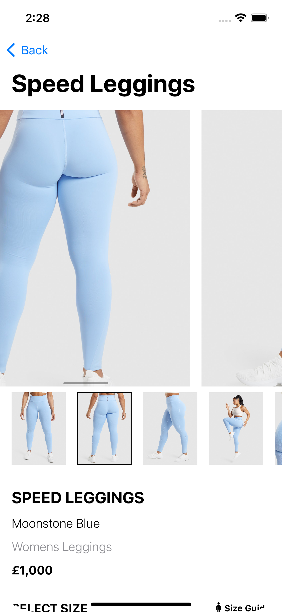 | 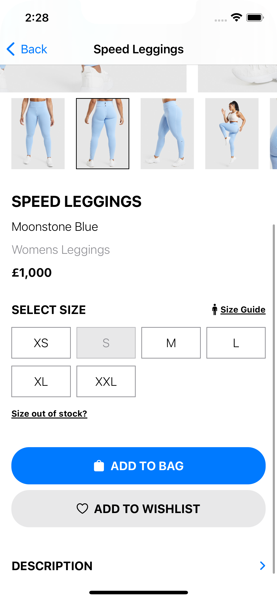 |
| 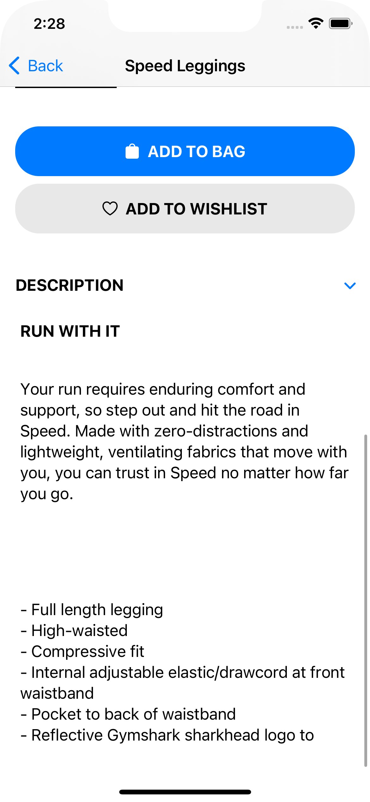 |  |                          |
